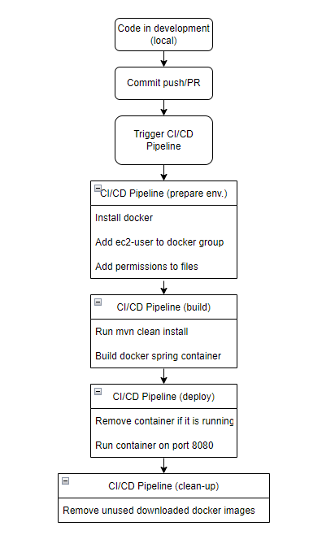

## GEPET :syringe: :dog2: :heart:
O gerenciador de vacinas do seu pet.

Para que o projeto funcione, é preciso instalar:
- [Jenkins](https://www.jenkins.io/) na máquina onde irão rodar as pipelines/jobs.
- [MySQL](https://www.mysql.com/) pois é o BD configurado para este projeto.

Para criar o container do SonarQube, é só utilizar o script abaixo:

```
docker run -d \
  --name sonarqube-gepet \
  --restart unless-stopped \
  -v sonar-data:/opt/sonarqube/data \
  -v sonar-logs:/opt/sonarqube/logs \
  -v sonar-extensions:/opt/sonarqube/extensions \
  -p 9000:9000 \
  sonarqube:8.9.8-community
```

As configurações da pipeline de CI/CD estão no arquivo Jenkinsfile.



Atualizado em 06/12/2022 - 21:57
